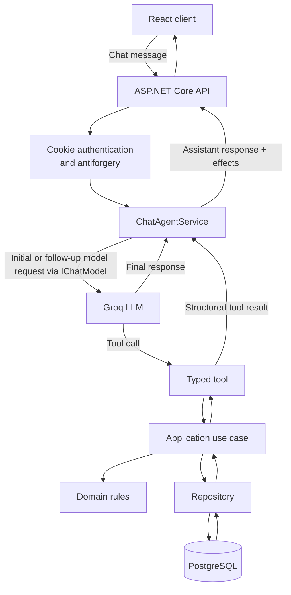

# Component diagram

This diagram shows what happens from a user chat message to the final assistant response. The React client is served by ASP.NET Core in production, so both use the same origin.

## Responsibilities

1. The React client sends the user message with the authenticated cookie and antiforgery token.
2. The API authenticates the request and resolves the current user on the server.
3. `ChatAgentService` asks the model for a final response or a typed tool call.
4. A tool delegates to an Application use case. It does not access PostgreSQL and does not receive a user identifier.
5. Application and Domain enforce booking rules; PostgreSQL is the final protection against concurrent double bookings.
6. The tool result returns to the model, which produces the final assistant response and optional UI effects.
