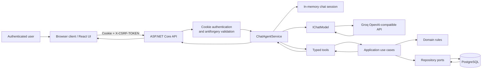

# Component diagram

This diagram follows a user message from the React client to the assistant response. The browser displays rooms and the signed-in user's bookings, but it does not make booking decisions or call booking mutation endpoints directly.

## Responsibilities

1. The React client sends the user message with its authenticated cookie and antiforgery token. It refreshes its read-only workspace data after a booking effect.
2. The API authenticates the request and resolves `ICurrentUser` from the server context.
3. `ChatAgentService` loads the user-owned session and asks the model to answer or request one of five typed tools.
4. A requested tool delegates to an existing Application use case; it never talks directly to PostgreSQL and never receives a user identifier.
5. Application and Domain validate the request. PostgreSQL is the final authority for concurrent booking conflicts.
6. Tool results return to the model, which produces the final assistant message. The API returns that message and optional UI effects such as `booking_created`.

The model has no authority to bypass business rules, impersonate a user, or claim an operation succeeded without a successful tool result.
